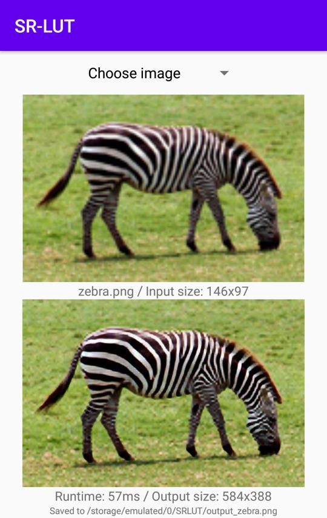

## Practical Single-Image Super-Resolution Using Look-Up Table

[[Paper]](https://openaccess.thecvf.com/content/CVPR2021/html/Jo_Practical_Single-Image_Super-Resolution_Using_Look-Up_Table_CVPR_2021_paper.html) 


## Dependency
- Python 3.6
- PyTorch 
- glob
- numpy
- pillow
- tqdm
- tensorboardx


## 1. Training deep SR network
1. Move into a directory.
```
cd ./1_Train_deep_model
```

2. Prepare DIV2K training images into `./train`.
- [HR images](http://data.vision.ee.ethz.ch/cvl/DIV2K/DIV2K_train_HR.zip) should be placed as `./train/DIV2K_train_HR/*.png`.
- [LR images](http://data.vision.ee.ethz.ch/cvl/DIV2K/DIV2K_train_LR_bicubic_X4.zip) should be placed as `./train/DIV2K_train_LR_bicubic/X4/*.png`.


3. Set5 HR/LR validation png images are already included in `./val`, or you can use other images.

4. You may modify user parameters in L22 in `./Train_Model_S.py`.

5. Run.
```
python Train_Model_S.py
```

6. Checkpoints will be saved in `./checkpoint/S`.
- Training log will be generated in `./log/S`.


## 2. Transferring to LUT
1. Move into a directory.
```
cd ./2_Transfer_to_LUT
```

2. Modify user parameters in L9 in `./Transfer_Model_S.py`.
- Specify a saved checkpoint in the step 1, or you can use attached `./Model_S.pth`.

3. Run.
```
python Transfer_Model_S.py
```

4. The resulting LUT will be saved like `./Model_S_x4_4bit_int8.npy`.


## 3. Testing using LUT
1. Move into a directory.
```
cd ./3_Test_using_LUT
```

2. Modify user parameters in L17 in `./Test_Model_S.py`.
- Specify the generated LUT in the step 2, or use attached LUTs (npy files).

3. Set5 HR/LR test images are already included in `./test`, or you can use other images.

4. Run.
```
python Test_Model_S.py      # Ours-S
python Test_Model_F.py      # Ours-F
python Test_Model_V.py      # Ours-V
```

5. Resulting images will be saved in `./output_S_x4_4bit/*.png`.

6. We can reproduce the results of Table 6 in the paper, by modifying the variable `SAMPLING_INTERVAL` in L19 in Test_Model_S.py to range 3-8.


## 4. Testing on a smartphone
1. Download [SR-LUT.apk](https://drive.google.com/file/d/1Od4uoMeM6ND26yvKAsT3ofzwIDtO0LSn/view?usp=sharing) and install it.

2. You can test Set14 images or other images.




## BibTeX
```
@InProceedings{jo2021practical,
   author = {Jo, Younghyun and Kim, Seon Joo},
   title = {Practical Single-Image Super-Resolution Using Look-Up Table},
   booktitle = {The IEEE/CVF Conference on Computer Vision and Pattern Recognition (CVPR)},
   month = {June},
   year = {2021}
}
```

